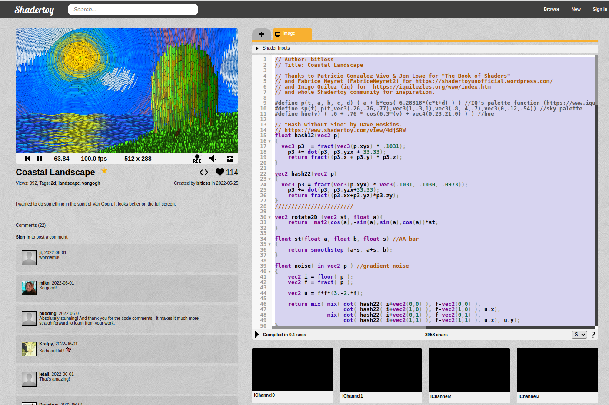
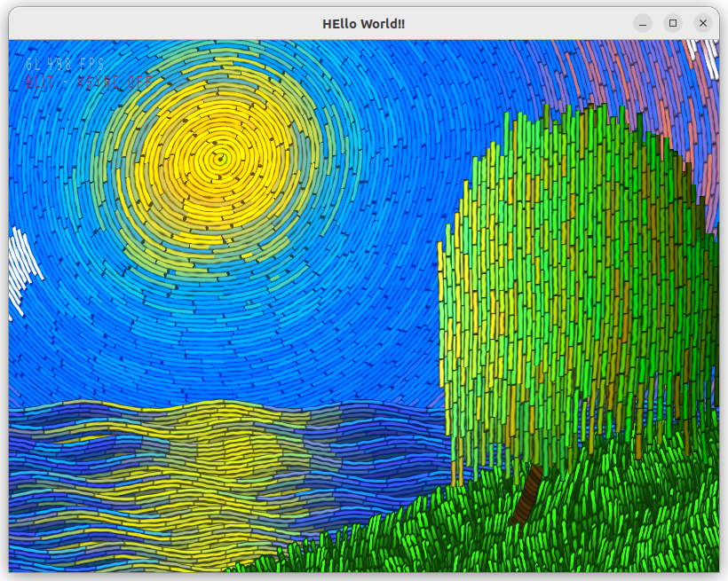

# Shadertoy OpenGL Wrapper
Copy the code from shadertoy in a file and run it native.

## Not supported features
Textures, sounds and anything that you load using channels.

## Required libs
Only uses GLFW so if you got it installed you are good to go.

## How to use it

Got to a shadertoy contribution that does not use channels, like https://www.shadertoy.com/view/fstyD4

Copy the code and paste into the file assets/shader.fs.

run make run_main on your linux distribution (windows build comming soon).

Enjoy

